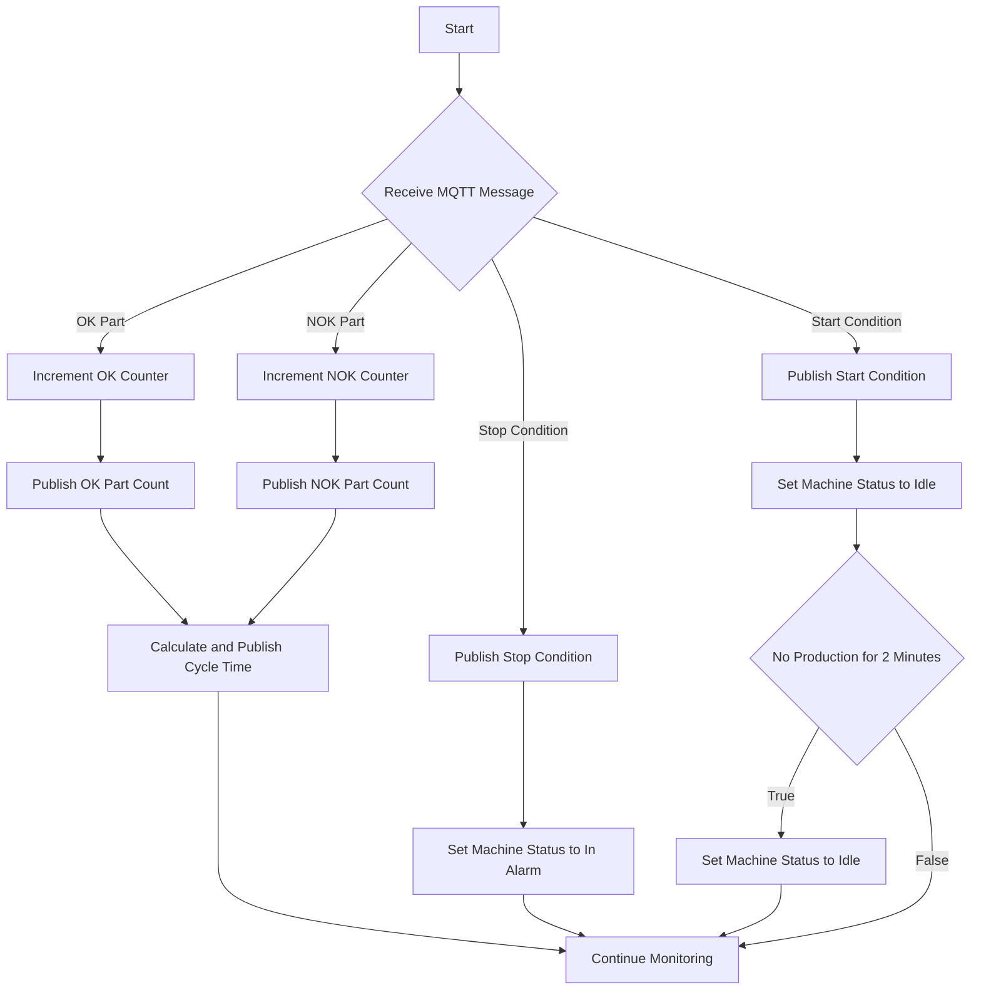

# Advantech Adam6000 with Coreflux MQTT broker -> Example : Machine Status and Part Counting Project

## Table of Contents
1. [Setup](#setup)
    - [Requirements](#requirements)
    - [Installation](#installation)
2. [Running the Project](#running-the-project)
3. [Configuration](#configuration)
    - [MQTT Topics and Brokers](#mqtt-topics-and-brokers)
4. [Concept of Unified Namespace](#concept-of-unified-namespace)
5. [Functionality Description](#functionality-description)
    - [Mermaid Diagram](#mermaid-diagram)
6. [Message Explanation](#message-explanation)
7. [Coreflux MQTT Broker](#coreflux-mqtt-broker)
8. [Using Advantech Adam 6050 with MQTT](#using-advantech-adam-6050-with-mqtt)

## Setup

### Requirements

Create a `requirements.txt` file with the following contents:

```
paho-mqtt
```

### Installation

1. Clone the repository or download the project files.
2. Navigate to the project directory.
3. Install the required packages using pip:

```sh
pip install -r requirements.txt
```

## Running the Project

To run the project, simply execute the main Python script:

```sh
python main.py
```

## Configuration

### MQTT Topics and Brokers

In the script, configure the MQTT broker settings and base topic:

```python
# MQTT settings
MQTT_BROKER = "iot.coreflux.cloud"
MQTT_PORT = 1883
BASE_TOPIC = "Company/Divison/Country/Local/AssemblyLines/Machine1"
```

You can change the `MQTT_BROKER`, `MQTT_PORT`, and `BASE_TOPIC` variables to match your MQTT broker settings and desired topic structure.

## Concept of Unified Namespace

The Unified Namespace (UNS) is a concept where all the data from various sources in an industrial environment is published to a single, cohesive topic structure in an MQTT broker. This allows for a standardized way of accessing data across different systems, improving interoperability and data integration.

In this project, the base topic is structured as:
```
Company/Divison/Country/Local/AssemblyLines/Machine1
```
This structure helps in organizing data in a hierarchical manner, making it easier to manage and retrieve relevant information.

## Functionality Description

This project subscribes to an MQTT topic to receive signals from a machine, processes these signals to update part counts and machine status, and publishes messages to specific topics based on the logic defined.

### Mermaid Diagram



## Message Explanation

The project publishes messages to specific topics based on the signals received. Each message contains relevant information.

### Example Messages

1. **OK Part Count**
    - **Topic:** `Company/Divison/Country/Local/AssemblyLines/Machine1/Counters/Ok`
    - **Payload:** `5`
    - **Explanation:** This message indicates that 5 OK parts have been counted so far.

2. **NOK Part Count**
    - **Topic:** `Company/Divison/Country/Local/AssemblyLines/Machine1/Counters/Scrap`
    - **Payload:** `2`
    - **Explanation:** This message indicates that 2 NOK parts have been counted so far.

3. **Total Count**
    - **Topic:** `Company/Divison/Country/Local/AssemblyLines/Machine1/Counters/Total`
    - **Payload:** `7`
    - **Explanation:** This message indicates that a total of 7 parts (OK + NOK) have been counted so far.

4. **Cycle Time**
    - **Topic:** `Company/Divison/Country/Local/AssemblyLines/Machine1/CycleTime`
    - **Payload:** `30.5`
    - **Explanation:** This message indicates that the cycle time for the last part produced was 30.5 seconds.

5. **Machine Status**
    - **Topic:** `Company/Divison/Country/Local/AssemblyLines/Machine1/Status`
    - **Payload:** `"Producing"`
    - **Explanation:** This message indicates that the machine is currently producing parts.

6. **Message Topic**
    - **Topic:** `Company/Divison/Country/Local/AssemblyLines/Machine1/Message`
    - **Payload Examples:**
        - `{"timestamp": 1625678901, "type": "StatusChangedToIdle"}`
        - `{"timestamp": 1625678901, "type": "StatusChangedToProduction"}`
        - `{"timestamp": 1625678901, "type": "NewPartOk"}`
        - `{"timestamp": 1625678901, "type": "NewPartNotOk"}`
    - **Explanation:** These messages provide detailed information about various events, such as status changes and part production.

### Status Messages

- **Producing:** The machine is actively producing parts.
- **ProducingWithScrap:** The machine is producing parts but has also produced scrap.
- **In Alarm:** The machine has encountered a stop condition and is not operational.
- **Idle:** The machine is not producing any parts and is idle.

### Conditions for Status Changes

- The machine starts in an **Idle** state.
- It goes to **In Alarm** when a stop condition is detected.
- It returns to **Idle** when a start condition is detected or if no production occurs within 2 minutes while in a production state.
- If a part is produced, the machine status changes to **Producing** or **ProducingWithScrap** based on the type of part produced.

## Coreflux MQTT Broker

The Coreflux MQTT Broker is a robust and scalable solution designed for efficient IoT communication. It supports lightweight messaging, making it ideal for IoT applications due to its low bandwidth usage and efficient data transmission. Coreflux MQTT Broker ensures reliable message delivery with various levels of Quality of Service (QoS) and supports secure communication through TLS/SSL encryption.

For testing purposes, you can use the broker at `iot.coreflux.cloud`. This broker is engineered to handle high message throughput and can be used to develop and test your MQTT applications in a real-world scenario【22†source】【23†source】【24†source】.

## Using Advantech Adam 6050 with MQTT

The Advantech Adam 6050 is a versatile I/O module that supports MQTT connectivity, making it suitable for integrating with IoT systems. This device can publish its I/O status to an MQTT broker, allowing for real-time monitoring and control. By configuring the Adam 6050 to connect to an MQTT broker, you can leverage its data in your IoT applications, ensuring seamless communication and data exchange【25†source】【26†source】.

To set up the Advantech Adam 6050 for MQTT:
1. Configure the network settings to connect to your local network.
2. Set the MQTT broker address and port in the Adam 6050 settings.
3. Define the topics for publishing the I/O status.
4. Use an MQTT client to subscribe to these topics and process the data as needed. 

This integration allows you to monitor and control industrial processes efficiently, using the Adam 6050's robust I/O capabilities combined with the flexibility of MQTT communication.
